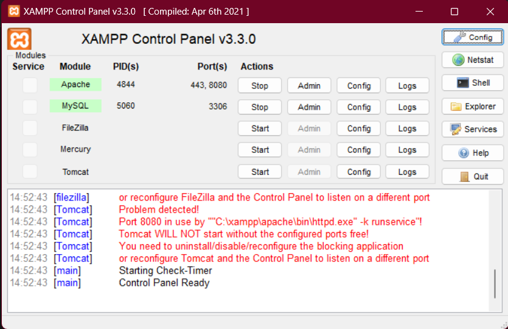
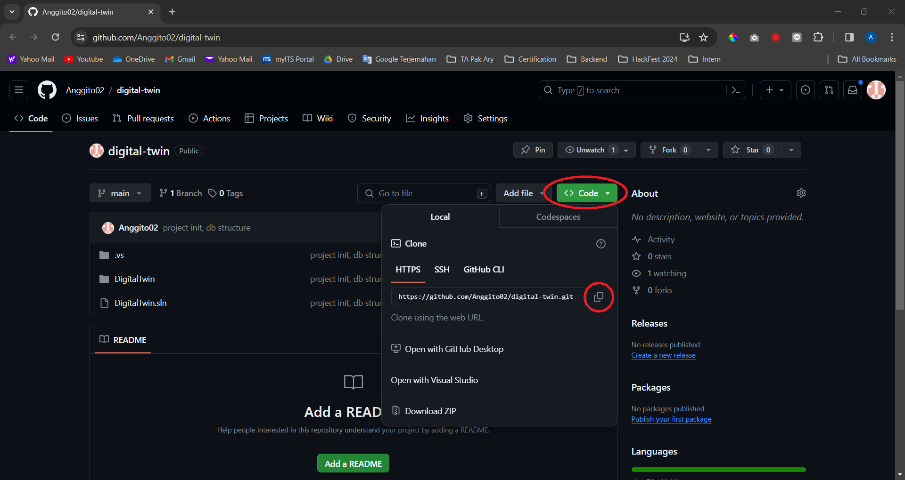
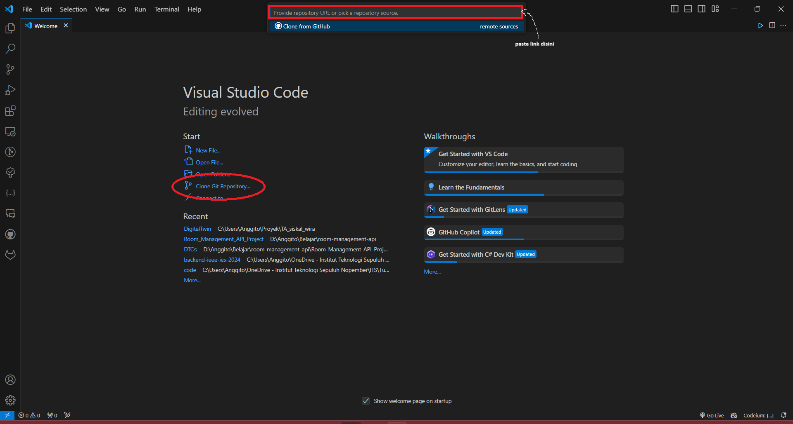
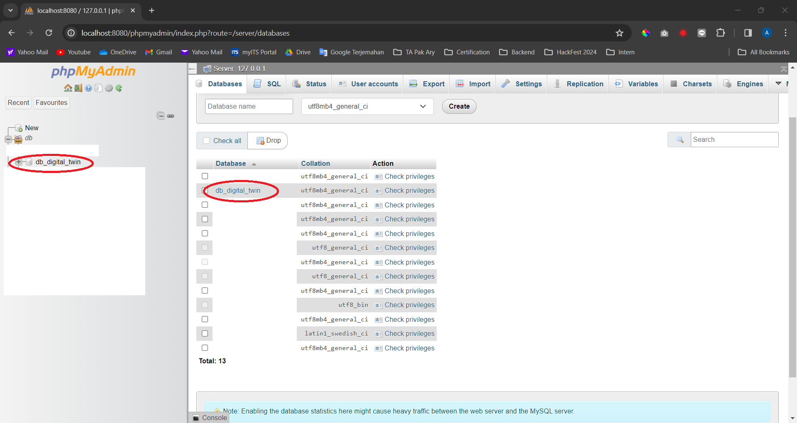
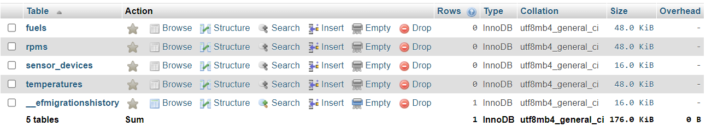

# Install Program
1. Download & Install Visual Studio Code (https://code.visualstudio.com/download)[https://code.visualstudio.com/download]
2. Download & Install XAMPP (https://www.apachefriends.org/download.html)[https://www.apachefriends.org/download.html]
3. Download .NET (https://dotnet.microsoft.com/en-us/download)[https://dotnet.microsoft.com/en-us/download]

## Aktifkan XAMPP
1. Buka XAMPP
2. Start Apache dan MySQL



3. Klik tombol `admin` pada MySQL di XAMPP untuk membuka `phpmyadmin`
4. Pastikan `phpmyadmin` sudah terbuka di browser

## Aktifkan .NET
1. Buka Terminal
2. Ketikkan prompt di bawah untuk memastikan dotnet sudah terinstall
```
dotnet --version
``` 

# Inisialisasi Project
## Clone Repository
1. Copy link repository github



2. Buka VS Code dan clone repository



3. Pilih folder tempat menyimpan project

## Install dotnet-ef melalui terminal
1. Klik `Ctrl + J` untuk membuka terminal
2. Ketikkan prompt di bawah untuk meng-install `dotnet-ef`
```
dotnet tool install --global dotnet-ef
```
3. Ketikkan prompt di bawah untuk memastikan `dotnet-ef` telah ter-install
```
dotnet ef
```

## Update MySQL database project
1. Klik `Ctrl + J` untuk membuka terminal
2. Ketikkan prompt di bawah untuk meng-update database
```
dotnet ef database update
```

3. Buka `phpmyadmin` menggunakan **XAMPP** (Ikuti langkah-langkah [Aktifkan XAMPP](#aktifkan-xampp))
4. Buka database dengan nama `db-digital-twin` untuk melihat struktur database



5. Klik `db-digital-twin` untuk membuka database
6. Struktur database muncul seperti gambar di bawah

